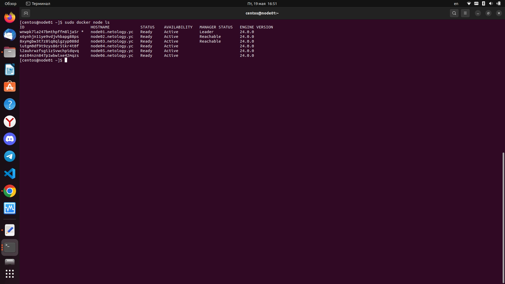
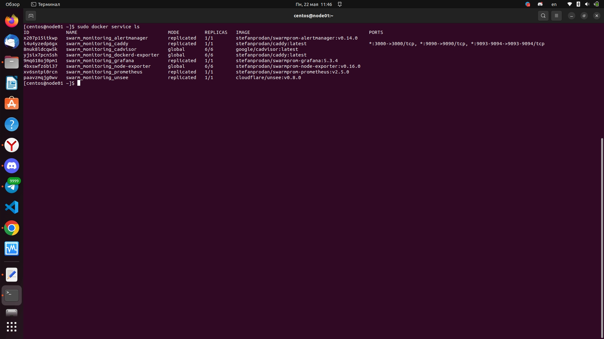

## Задача 1

Дайте письменые ответы на следующие вопросы:

- В чём отличие режимов работы сервисов в Docker Swarm кластере: replication и global?
- Какой алгоритм выбора лидера используется в Docker Swarm кластере?
- Что такое Overlay Network?

Ответ:

1. Отличие режимов работы сервисов Docker Swarm кластере заключается, в том, что в режиме [global](https://docs.docker.com/engine/swarm/how-swarm-mode-works/services/) сервис запускается на всех нодах. Если используется режим  replication, то указывается количество реплик используемых для сервиса.

2. Для управления глобальным состоянием кластера используется протокол [Raft](https://docs.docker.com/engine/swarm/raft/) в задачи, которые решаются данным протоколом так же входить выбор лидера.

3. Используется для связи контейнеров расположенных на разных хостах. При построении используется уже существующая сеть и технология vxlan. Может быть включено шифрование IPSec.

## Задача 2
Создать ваш первый Docker Swarm кластер в Яндекс.Облаке

Для получения зачета, вам необходимо предоставить скриншот из терминала (консоли), с выводом команды:
```
docker node ls
```

Ответ: 




## Задача 3

Создать ваш первый, готовый к боевой эксплуатации кластер мониторинга, состоящий из стека микросервисов.

Для получения зачета, вам необходимо предоставить скриншот из терминала (консоли), с выводом команды:
```
docker service ls
```

Ответ:


## Задача 4 (*)

Выполнить на лидере Docker Swarm кластера команду (указанную ниже) и дать письменное описание её функционала, что она делает и зачем она нужна:
```
# см.документацию: https://docs.docker.com/engine/swarm/swarm_manager_locking/
docker swarm update --autolock=true
```