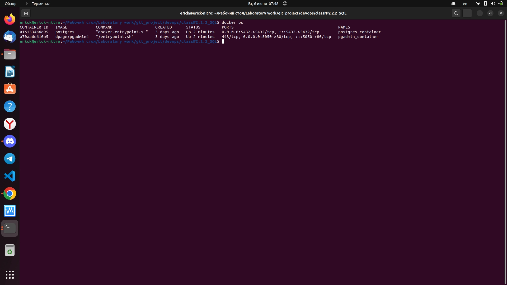
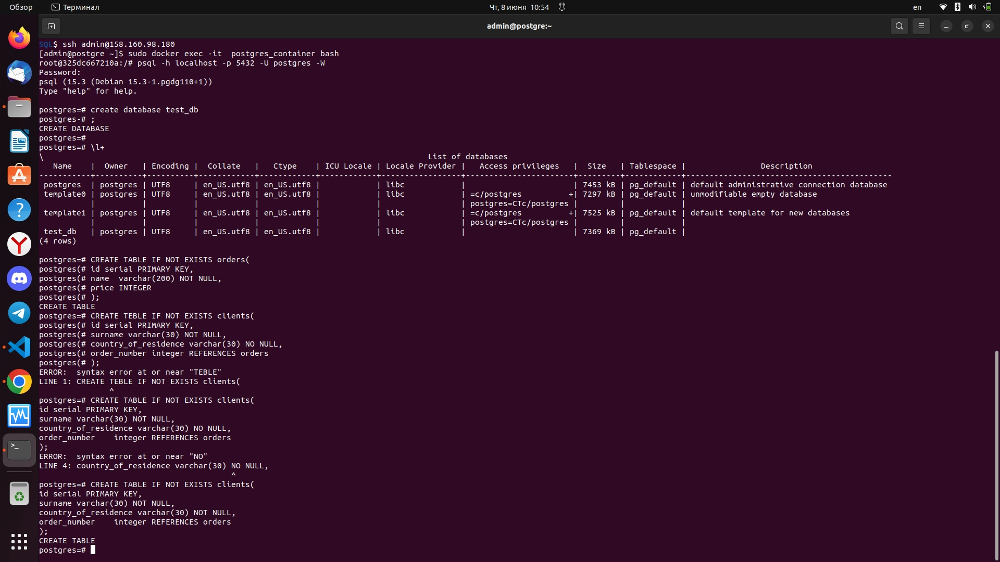
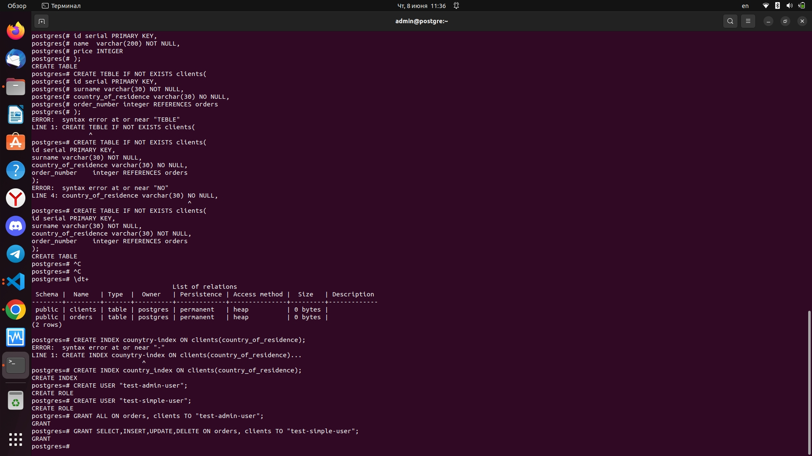
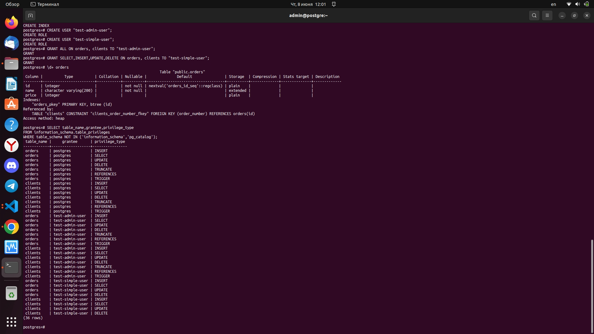
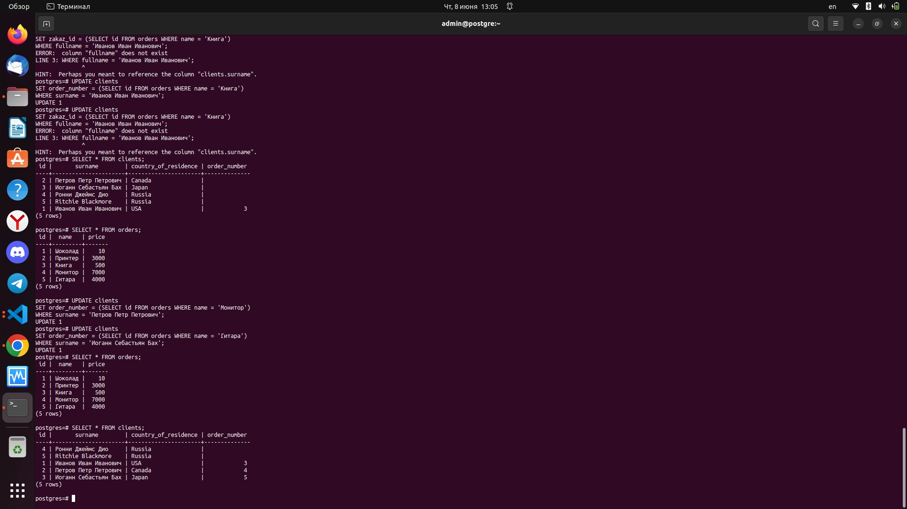
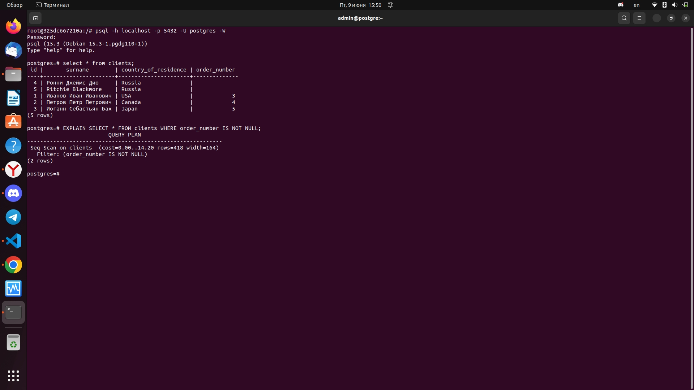

## Задача 1

Используя Docker, поднимите инстанс PostgreSQL (версию 12) c 2 volume, 
в который будут складываться данные БД и бэкапы.

Приведите получившуюся команду или docker-compose-манифест.

    Ответ:
    подключаемся к контейнеру и подключаемся к самой базе данных
    
    ```
    sudo docker exec -it  postgres_container bash
    psql -h localhost -p 5432 -U postgres -W
    password:
    ```


## Задача 2

В БД из задачи 1: 

- создайте пользователя test-admin-user и БД test_db;
- в БД test_db создайте таблицу orders и clients (спeцификация таблиц ниже);
- предоставьте привилегии на все операции пользователю test-admin-user на таблицы БД test_db;
- создайте пользователя test-simple-user;
- предоставьте пользователю test-simple-user права на SELECT/INSERT/UPDATE/DELETE этих таблиц БД test_db.

Таблица orders:

- id (serial primary key);
- наименование (string);
- цена (integer).

Таблица clients:

- id (serial primary key);
- фамилия (string);
- страна проживания (string, index);
- заказ (foreign key orders).

Приведите:

- итоговый список БД после выполнения пунктов выше;
- описание таблиц (describe);
- SQL-запрос для выдачи списка пользователей с правами над таблицами test_db;
- список пользователей с правами над таблицами test_db.

    Ответ:
    
```SQL 
    #создаем базу данных
    create database teat_db 

    #создаем таблицы orders и clients
    CREATE TABLE IF NOT EXISTS orders(
        id          serial PRIMARY KEY,
        name        varchar(200) NOT NULL,
        price       INTEGER
    );
    CREATE TABLE IF NOT EXISTS clients(
        id                   serial PRIMARY KEY,
        surname              varchar(30) NOT NULL,
        country_of_residence varchar(30) NOT NULL,
        order_number         integer REFERENCES orders
    );
    #создаем индекс country
    CREATE INDEX country_index ON clients (country_of_residents);
    #создаем пользователей 
    CREATE USER "test-admin-user";
    CREATE USER "test-simple-user";
    #присваиваем права пользователям 
    GRANT ALL ON orders, clients TO "test-admin-user";
    GRANT SELECT,INSERT,UPDATE,DELETE ON orders, clients TO "test-simple-user";
```






## Задача 3

Используя SQL-синтаксис, наполните таблицы следующими тестовыми данными:

Таблица orders

|Наименование|цена|
|------------|----|
|Шоколад| 10 |
|Принтер| 3000 |
|Книга| 500 |
|Монитор| 7000|
|Гитара| 4000|

Таблица clients

|ФИО|Страна проживания|
|------------|----|
|Иванов Иван Иванович| USA |
|Петров Петр Петрович| Canada |
|Иоганн Себастьян Бах| Japan |
|Ронни Джеймс Дио| Russia|
|Ritchie Blackmore| Russia|

Используя SQL-синтаксис:
- вычислите количество записей для каждой таблицы.

Приведите в ответе:

    - запросы,
    - результаты их выполнения.

    Ответ:
```SQL
    #заполняем таблицы
    INSERT INTO 
        orders (name,price) 
    VALUES
        ('Шоколад',10),
        ('Принтер',3000),
        ('Книга',500),
        ('Монитор',7000),
        ('Гитара',4000);
    INSERT 0 5

    INSERT INTO 
        clients (surname,country_of_residents) 
    VALUES
        ('Иванов Иван Иванович','USA'),
        ('Петров Петр Петрович','Canada'),
        ('Иоганн Себастьян Бах','Japan'),
        ('Ронни Джеймс Дио','Russia'),
        ('Ritchie Blackmore','Russia');
    INSERT 0 5
    #Посчитал:

    test_db=# select count(*) from clients;
    test_db=# select count(*) from clients;
```

## Задача 4

Часть пользователей из таблицы clients решили оформить заказы из таблицы orders.

Используя foreign keys, свяжите записи из таблиц, согласно таблице:

|ФИО|Заказ|
|------------|----|
|Иванов Иван Иванович| Книга |
|Петров Петр Петрович| Монитор |
|Иоганн Себастьян Бах| Гитара |

Приведите SQL-запросы для выполнения этих операций.

Приведите SQL-запрос для выдачи всех пользователей, которые совершили заказ, а также вывод этого запроса.
 
Подсказка: используйте директиву `UPDATE`.

    Ответ:
```SQL
    #используя утилиту UPDATE связываем таблицу клиентов и таблицу заказов
    UPDATE clients
    SET order_number = (SELECT id FROM orders WHERE name = 'Монитор')
    WHERE surname = 'Петров Петр Петрович';
    UPDATE clients
    SET order_number = (SELECT id FROM orders WHERE name = 'Гитара')
    WHERE surname = 'Иоганн Себастьян Бах';
    UPDATE clients
    SET zakaz_id = (SELECT id FROM orders WHERE name = 'Книга')
    WHERE fullname = 'Иванов Иван Иванович';
```


## Задача 5

Получите полную информацию по выполнению запроса выдачи всех пользователей из задачи 4 
(используя директиву EXPLAIN).

Приведите получившийся результат и объясните, что значат полученные значения.

    Ответ:



cost - стоимость операции
row - ожидаемое число строк
width - средняя ширина строки в байтах

## Задача 6

Создайте бэкап БД test_db и поместите его в volume, предназначенный для бэкапов (см. задачу 1).

Остановите контейнер с PostgreSQL, но не удаляйте volumes.

Поднимите новый пустой контейнер с PostgreSQL.

Восстановите БД test_db в новом контейнере.

Приведите список операций, который вы применяли для бэкапа данных и восстановления. 

    Ответ:
 ```bash
    #Cоздаем дамп БД в простом текстовом формате
    pg_dump -U postgres test_db > /var/lib/postgresql/bckp/dump.sql


    #останавливаем старый контейнер и запускаем новый
    #заходим в новый контейнер и восстанавливаем данные командой


    psql -U postgres test_db -f /var/lib/postgresql/bckp/dump.sql
```