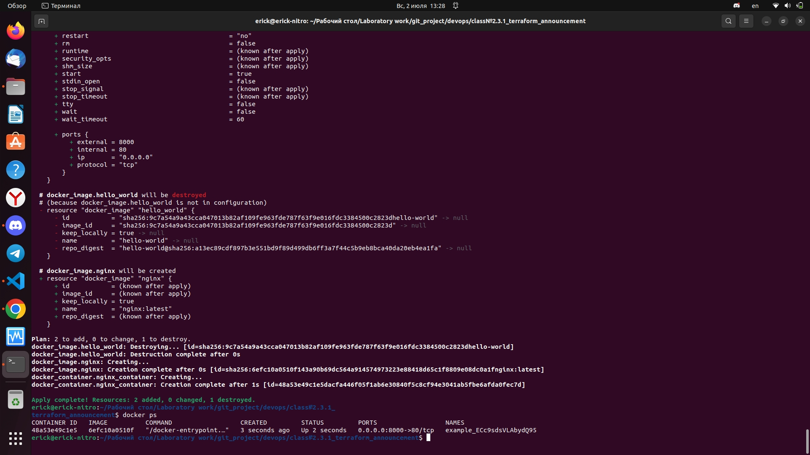
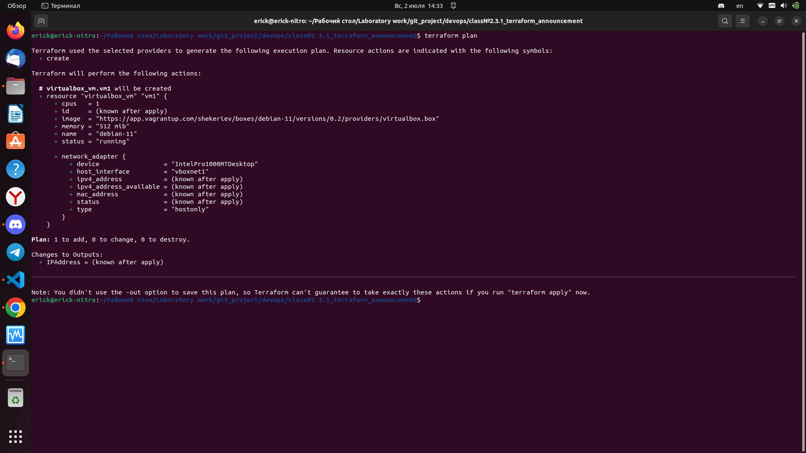

# Домашнее задание к занятию «Введение в Terraform»

### Цель задания

1. Установить и настроить Terrafrom.
2. Научиться использовать готовый код.

------

### Чеклист готовности к домашнему заданию

1. Скачайте и установите актуальную версию **terraform** >=1.4.X . Приложите скриншот вывода команды ```terraform --version```.


2. Скачайте на свой ПК данный git репозиторий. Исходный код для выполнения задания расположен в директории **01/src**.

3. Убедитесь, что в вашей ОС установлен docker.

------

### Инструменты и дополнительные материалы, которые пригодятся для выполнения задания

1. Репозиторий с ссылкой на зеркало для установки и настройки Terraform  [ссылка](https://github.com/netology-code/devops-materials).
2. Установка docker [ссылка](https://docs.docker.com/engine/install/ubuntu/). 
------

### Задание 1

1. Перейдите в каталог [**src**](https://github.com/netology-code/ter-homeworks/tree/main/01/src). Скачайте все необходимые зависимости, использованные в проекте. 
2. Изучите файл **.gitignore**. В каком terraform файле согласно этому .gitignore допустимо сохранить личную, секретную информацию?

 Ответ:
    .tfstate
    *.tfstate.*

3. Выполните код проекта. Найдите  в State-файле секретное содержимое созданного ресурса **random_password**, пришлите в качестве ответа конкретный ключ и его значение.

 Ответ:
    "result": "ECc9sdsVLAbydQ95"

4. Раскомментируйте блок кода, примерно расположенный на строчках 29-42 файла **main.tf**.
Выполните команду ```terraform validate```. Объясните в чем заключаются намеренно допущенные ошибки? Исправьте их.

    Ответ:
    1.Не указано имя в блоке resourse "docker_image", в следующем блоке resourse "docker_container" идет обращение с указанием имени
    2. В блоке resourse "docker_container" не правильно указано имя ресурса, так же неправильно указано обращениек ресурсу resourse "random_password" и ошибка в "result"

5. Выполните код. В качестве ответа приложите вывод команды ```docker ps```

    Ответ: 
    

6. Замените имя docker-контейнера в блоке кода на ```hello_world```, выполните команду ```terraform apply -auto-approve```.
Объясните своими словами, в чем может быть опасность применения ключа  ```-auto-approve``` ? В качестве ответа дополнительно приложите вывод команды ```docker ps```
 
 Ответ:
    -auto-apprive опасен тем, что благодаря этой команде не показывается предварительный план и сразу запускается процесс перестройки terraform нового кода, соответственно это может привести к непредвиденным ситуациям.
    

8. Уничтожьте созданные ресурсы с помощью **terraform**. Убедитесь, что все ресурсы удалены. Приложите содержимое файла **terraform.tfstate**. 

    Ответ:
    ```
    {
    "version": 4,
    "terraform_version": "1.4.6",
    "serial": 29,
    "lineage": "50d31dce-ca10-9980-f242-fd3458283a0f",
    "outputs": {},
    "resources": [],
    "check_results": null
    }
    ```
9. Объясните, почему при этом не был удален docker образ **nginx:latest** ? Ответ подкрепите выдержкой из документации провайдера.

 Ответ:
 
 keep_locally (Логическое значение) Если true, то изображение Docker не будет удалено при операции уничтожения. Если это значение равно false, изображение будет удалено из локального хранилища docker при операции уничтожения.
 у нас соответственно keep locally-true
------

## Дополнительные задания (со звездочкой*)

**Настоятельно рекомендуем выполнять все задания под звёздочкой.**   Их выполнение поможет глубже разобраться в материале.   
Задания под звёздочкой дополнительные (необязательные к выполнению) и никак не повлияют на получение вами зачета по этому домашнему заданию. 

### Задание 2*

1. Изучите в документации provider [**Virtualbox**](https://docs.comcloud.xyz/providers/shekeriev/virtualbox/latest/docs) от 
shekeriev.
2. Создайте с его помощью любую виртуальную машину. Чтобы не использовать VPN советуем выбрать любой образ с расположением в github из [**списка**](https://www.vagrantbox.es/)

В качестве ответа приложите plan для создаваемого ресурса и скриншот созданного в VB ресурса. 


