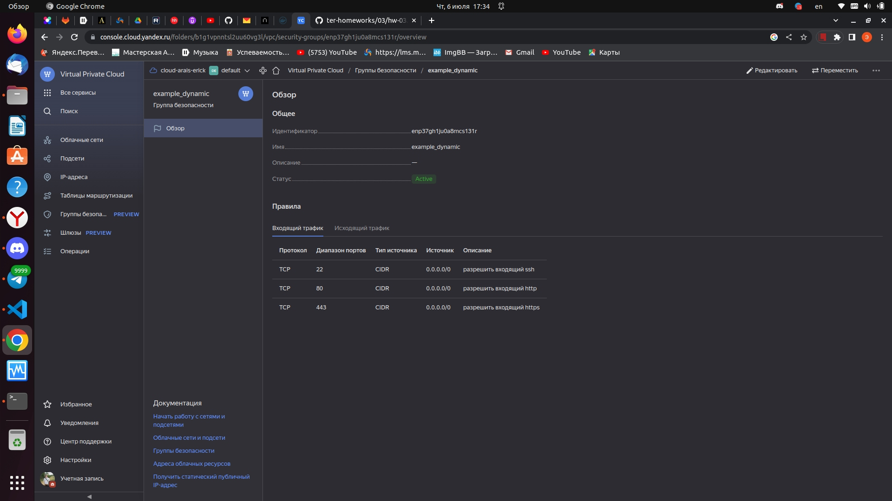
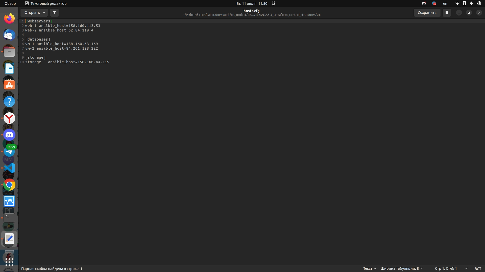
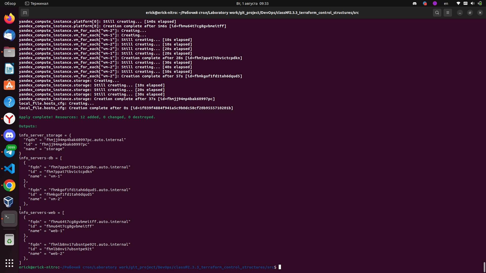

### Управляющие конструкции в коде Terraform

### Задача №1

1. Изучите проект.
2. Заполните файл personal.auto.tfvars
3. Инициализируйте проект, выполните код (он выполнится даже если доступа к preview нет).

Примечание: Если у вас не активирован preview доступ к функционалу "Группы безопасности" в Yandex Cloud - запросите доступ у поддержки облачного провайдера. Обычно его выдают в течении 24-х часов.

Приложите скриншот входящих правил "Группы безопасности" в ЛК Yandex Cloud  или скриншот отказа в предоставлении доступа к preview версии.




------

### Задача №2

1. Создайте файл count-vm.tf. Опишите в нем создание двух **одинаковых** ВМ  web-1 и web-2(не web-0 и web-1!), с минимальными параметрами, используя мета-аргумент **count loop**. Назначьте ВМ созданную в 1-м задании группу безопасности.

    Ответ:

    [Использование мета-аргумента count loop](./src/count-vm.tf)

2. Создайте файл for_each-vm.tf. Опишите в нем создание 2 ВМ с именами "main" и "replica" **разных** по cpu/ram/disk , используя мета-аргумент **for_each loop**. Используйте для обеих ВМ одну, общую переменную типа list(object({ vm_name=string, cpu=number, ram=number, disk=number  })). При желании внесите в переменную все возможные параметры.

    Ответ:

    [Использование мета-аргумента for_each loop](./src/for_each-vm.tf)

3. ВМ из пункта 2.2 должны создаваться после создания ВМ из пункта 2.1.

    Ответ:

    Добавлем depends_on = [resource.yandex_compute_instance.platform] в код файла [for_each-vm.tf](./src/for_each-vm.tf)

4. Используйте функцию file в local переменной для считывания ключа ~/.ssh/id_rsa.pub и его последующего использования в блоке metadata, взятому из ДЗ №2.

    Ответ:

    Для настройки local переменной создаем файл  [locals.tf](./src/locals.tf)

5. Инициализируйте проект, выполните код.

------

### Задача №3

1. Создайте 3 одинаковых виртуальных диска, размером 1 Гб с помощью ресурса yandex_compute_disk и мета-аргумента count в файле **disk_vm.tf** .
2. Создайте в том же файле одну ВМ c именем "storage" . Используйте блок **dynamic secondary_disk{..}** и мета-аргумент for_each для подключения созданных вами дополнительных дисков.

    Ответ:
    
    [Использование блока dynamic secondary_disk{}](./src/disk_vm.tf)
------

### Задача №4

1. В файле ansible.tf создайте inventory-файл для ansible.
Используйте функцию tepmplatefile и файл-шаблон для создания ansible inventory-файла из лекции.
Готовый код возьмите из демонстрации к лекции [**demonstration2**](https://github.com/netology-code/ter-homeworks/tree/main/demonstration2).
Передайте в него в качестве переменных группы виртуальных машин из задания 2.1, 2.2 и 3.2.(т.е. 5 ВМ)
2. Инвентарь должен содержать 3 группы [webservers], [databases], [storage] и быть динамическим, т.е. обработать как группу из 2-х ВМ так и 999 ВМ.
4. Выполните код. Приложите скриншот получившегося файла. 

    Ответ:

    1. Создаем файл [ansible.tf](./src/ansible.tf)
    
    2. Создаем файл [hosts.tftpl](./src/hosts.tftpl)

    3. Запускаем программу terraform apply, получаем файл hosts.cfg




------


### Задача №5
1. Напишите output, который отобразит все 5 созданных ВМ в виде списка словарей:
``` 
[
 {
  "name" = 'имя ВМ1'
  "id"   = 'идентификатор ВМ1'
  "fqdn" = 'Внутренний FQDN ВМ1'
 },
 {
  "name" = 'имя ВМ2'
  "id"   = 'идентификатор ВМ2'
  "fqdn" = 'Внутренний FQDN ВМ2'
 },
 ....
]
```
Приложите скриншот вывода команды ```terrafrom output```

Ответ:

Выводы все отражены в файле  [output.tf](./src/output.tf)



------

### Задача №6

1. Используя null_resource и local-exec примените ansible-playbook к ВМ из ansible inventory файла.
Готовый код возьмите из демонстрации к лекции [**demonstration2**](https://github.com/netology-code/ter-homeworks/tree/main/demonstration2).
3. Дополните файл шаблон hosts.tftpl. 
Формат готового файла:
```netology-develop-platform-web-0   ansible_host="<внешний IP-address или внутренний IP-address если у ВМ отсутвует внешний адрес>"```

Для проверки работы уберите у ВМ внешние адреса. Этот вариант используется при работе через bastion сервер.
Для зачета предоставьте код вместе с основной частью задания.


Ответ:

Меняем содержимое файла hosts.tftpl

```
[webservers]  
  
{{ server.name }} ansible_host={{ server.network_interface[0].external_ip_address }}{{ server.network_interface[0].internal_ip_address }}  
  
  
[databases]  
  
{{ server.name }} ansible_host={{ server.network_interface[0].external_ip_address }}{{ server.network_interface[0].internal_ip_address }}  
  
  
[storage]  
  
{{ server.name }} ansible_host={{ server.network_interface[0].external_ip_address }}{{ server.network_interface[0].internal_ip_address }}  
  
```

и добавляем 

```terraform 
resource "null_resource" "ansible_provisioning" {  
  depends_on = [resource.yandex_compute_instance.storage]
  provisioner "local-exec" {  
    command = "ansible-playbook -i hosts.cfg ../demonstration2/test.yml"   
    
    working_dir = path.module  
    interpreter = ["bash", "-c"]  
  }  
} 
```