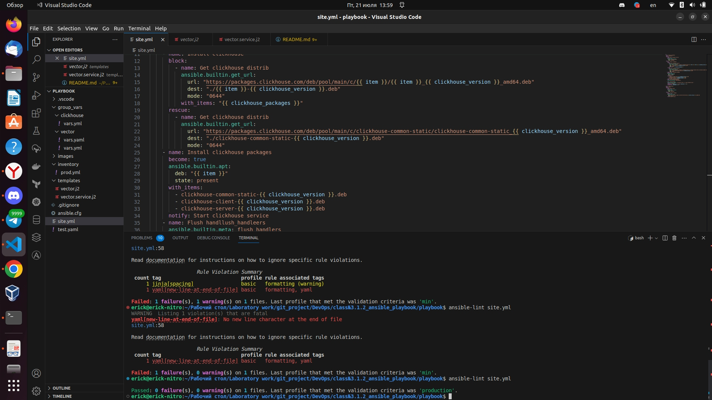
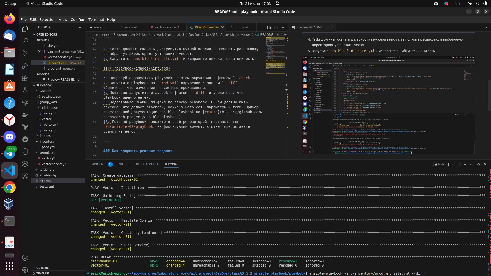

### Работа с Playbook


1. Подготовьте свой inventory-файл `prod.yml`.
2. Допишите playbook: нужно сделать ещё один play, который устанавливает и настраивает [vector](https://vector.dev). Конфигурация vector должна деплоиться через template файл jinja2.
3. При создании tasks рекомендую использовать модули: `get_url`, `template`, `unarchive`, `file`.

```Yaml

- name: Vector | Install rpm
  hosts: vector
  tasks:
    - name: Install Vector
      become: true
      ansible.builtin.yum:
        name: "{{ vector_url }}"
        state: present
    - name: Vector | Template Config
      ansible.builtin.template:
        src: vector.j2
        dest: vector.yml
        mode: "0644"
        owner: "{{ ansible_user_id }}"
        group: "{{ ansible_user_gid }}"
        validate: vector validate --no-environment --config-yaml %s
    - name: Vector | Create systemd unit
      become: true
      ansible.builtin.template:
        src: vector.service.j2
        dest: /etc/systemd/vector.service
        mode: "0755"
        owner: "{{ ansible_user_id }}"
        group: "{{ ansible_user_gid }}"
    - name: Vector | Start Service
      become: true
      ansible.builtin.systemd:
        name: vector
        state: started
        daemon_reload: true
```

4. Tasks должны: скачать дистрибутив нужной версии, выполнить распаковку в выбранную директорию, установить vector.
5. Запустите `ansible-lint site.yml` и исправьте ошибки, если они есть.



6. Попробуйте запустить playbook на этом окружении с флагом `--check`.



7. Запустите playbook на `prod.yml` окружении с флагом `--diff`. Убедитесь, что изменения на системе произведены.
8. Повторно запустите playbook с флагом `--diff` и убедитесь, что playbook идемпотентен.


9. Подготовьте README.md-файл по своему playbook. В нём должно быть описано: что делает playbook, какие у него есть параметры и теги. Пример качественной документации ansible playbook по [ссылке](https://github.com/opensearch-project/ansible-playbook).
10. Готовый playbook выложите в свой репозиторий, поставьте тег `08-ansible-02-playbook` на фиксирующий коммит, в ответ предоставьте ссылку на него.

---