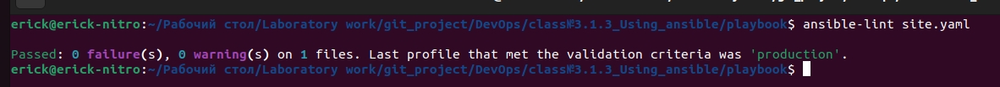
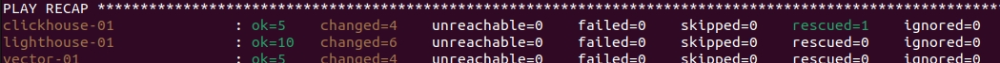

# Домашнее задание к занятию 3 «Использование Ansible»

## Подготовка к выполнению

1. Подготовьте в Yandex Cloud три хоста: для `clickhouse`, для `vector` и для `lighthouse`.
2. Репозиторий LightHouse находится [по ссылке](https://github.com/VKCOM/lighthouse).

## Основная часть

1. Допишите playbook: нужно сделать ещё один play, который устанавливает и настраивает LightHouse.
2. При создании tasks рекомендую использовать модули: `get_url`, `template`, `yum`, `apt`.
3. Tasks должны: скачать статику LightHouse, установить Nginx или любой другой веб-сервер, настроить его конфиг для открытия LightHouse, запустить веб-сервер.

```yaml
- name: Nginx
  hosts: lighthouse
  handlers:
    - name: Start-nginx
      become: true
      ansible.builtin.service:
        name: nginx
        state: started
    - name: Restart Nginx
      become: true
      ansible.builtin.service:
        name: nginx
        state: restarted
  tasks:
    - name: Install epel-release
      become: true
      ansible.builtin.yum:
        name: epel-release
        state: present
    - name: Install nginx
      become: true
      ansible.builtin.yum:
        name: nginx
        state: present
      notify: Start-nginx
    - name: Nginx | template config
      ansible.builtin.template:
        src: templates/nginx.j2
        dest: /etc/nginx/nginx.conf
        mode: "0644"
      notify: Restart Nginx
- name: Install lighthouse
  hosts: lighthouse
  become: true
  handlers:
    - name: Restart-nginx
      become: true
      ansible.builtin.service:
        name: nginx
        state: restarted
  pre_tasks:
    - name: Install dependencies
      become: true
      ansible.builtin.yum:
        name: git
        state: present
  tasks:
    - name: Lighthouse | Copy from git
      ansible.builtin.git:
              repo: "{{ lighthouse_url }}"
        version: master
        dest: "{{ lighthouse_dir }}"
    - name: Lighthouse | create config
      become: true
      ansible.builtin.template:
        src: lighthouse.conf.j2
        dest: /etc/nginx/conf.d/default.conf
        mode: "0644"
      notify: Restart-nginx
```

4. Подготовьте свой inventory-файл `prod.yml`.

```yaml
---
clickhouse:
  hosts:
    clickhouse-01:
      ansible_host: 158.160.47.84

vector:
  hosts:
    vector-01:
      ansible_host: 158.160.118.144

lighthouse:
  hosts:
    lighthouse-01:
      ansible_host: 158.160.47.84
```

5. Запустите `ansible-lint site.yml` и исправьте ошибки, если они есть.



6. Попробуйте запустить playbook на этом окружении с флагом `--check`.
7. Запустите playbook на `prod.yml` окружении с флагом `--diff`. Убедитесь, что изменения на системе произведены.

```bash
ansible-playbook -i inventory/prod.yml site.yaml --diff
```



8. Повторно запустите playbook с флагом `--diff` и убедитесь, что playbook идемпотентен.

```bash
ansible-playbook -i inventory/prod.yml site.yaml --diff
```


9. Подготовьте README.md-файл по своему playbook. В нём должно быть описано: что делает playbook, какие у него есть параметры и теги. 

    [README.md](./playbook/README.md)

10. Готовый playbook выложите в свой репозиторий, поставьте тег `08-ansible-03-yandex` на фиксирующий коммит, в ответ предоставьте ссылку на него. 

    [Playbook](./playbook/site.yaml)
